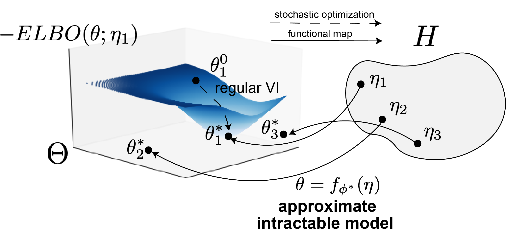

  <a class="active" href="#">Home</a>
  <a href="families">Exp Fams Library</a>

# Introduction #
Many models used in machine learning are intractable exponential families.
Inference in intractable exponential families incurs some computational cost,
often that of stochastic optimziation through variational inference. We 
introduce a deep generative two-network architecture called exponential family 
networks (EFNs, [Bittner et al. 2019](#Bittner2018approximating)) for learning
intractable exponential family _models_ (not single distributions). EFNs learn
a smooth function 
$$f_{\phi^*} : H \rightarrow \Theta$$ 
mapping natural parameters $$\eta$$ to optimal variational parameters $$\theta^*$$.

# Background #
## Why exponential families? ##
Exponential family models $$\mathcal{P}$$ have the form

$$\mathcal{P} = \left\{ \frac{h(\cdot)}{A(\eta)} \exp\left\{ \eta^\top t(\cdot) \right \} : \eta \in H \right\}$$

with natural parameter $$\eta$$, sufficient statistics $$t(\cdot)$$, base measure $$h(\cdot)$$, and log normalizer $$A(\eta)$$.  

_Side note_: As we go on, we "suppress" the base measure $$h(\cdot)$$, since we can simply re-write the exponential family moving
$$h(\cdot)$$ into the sufficient statistics vector by taking its $$\log$$. Thus, in this representation, the natural parameter vector also implicitly has a concatenated 1 just as the sufficient statistics have a concatenated $$\log(h(\cdot))$$.

$$\mathcal{P} = \left\{ \frac{1}{A(\eta)} \exp\left\{ \begin{bmatrix} \eta \\ 1 \end{bmatrix}^\top \begin{bmatrix} t(\cdot) \\ \log(h(\cdot)) \end{bmatrix} \right \} : \eta \in H \right\}$$

We focus on the fundamental problem setup of Bayesian inference, which is $$N$$ conditionally iid draws of data points $$x_i$$ given a global latent variable $$z$$.

With an exponential family likelihood

$$ p(x_i|z) = \frac{1}{A(z)} \exp\left\{ \nu(z)^\top t(x_i) \right \} $$

and prior

$$ p_0(z) = \frac{1}{A_0(\alpha)} \exp\left\{ \alpha^\top t_0(z) \right\} $$

the posterior has the form:

$$ p(z | x_1,...,x_N) = p(z) \prod_{i=1}^N p(x_i \mid z) \propto  \exp\left\{ \begin{bmatrix} \alpha \\ \sum_i t(x_i) \\ -N \end{bmatrix}^\top\begin{bmatrix} t_0(z) \\ \nu(z) \\ \log A(z) \end{bmatrix} \right\} $$

Notice that the natural parameters of the posterior of such exponential family models are comprised of the natural parameter of the prior $$\alpha$$, the sum of the sufficient statistics of the data points $$\sum_i t(x_i)$$, and a final element $$-N$$.  Notice a *key* observation that the dimensionality of the natural parameter of the posterior does not change with the the number of data points sampled.  From the Pitman, Koopman, Darmois Theorem, we know that only models with exponential family likelihoods have this property.

# Exponential family networks #
EFNs are comprised of two networks, the density network: $$z = g_\theta(\omega)$$ and the parameter network $$\theta = f_\phi(\eta)$$

The parameter network (horizontal) is a fully connected neural network mapping 
$$f_{\phi} : H \rightarrow \Theta$$. EFNs learn approximations $$\mathcal{Q_\phi} 
\subset \mathcal{M}$$ of exponential family models $$\mathcal{P}$$, so that
$$\mathcal{Q_\phi} \approx \mathcal{P}$$, where 

$$Q_\phi = \left\{q_{f_\phi} (z; \eta) : \eta \in H \right\}$$

For a given $$\eta$$, we minimize the KL divergence $$\mathcal{D}$$ between the 
indexed distribution of $$\mathcal{P}$$ and $$\mathcal{Q}_\phi$$.

$$D\left( q_\phi(z;\eta) || p(z;\eta) \right) = \mathbb{E}_{q_\phi} \Bigg( \log q_\phi(z;\eta) - \eta^\top t(z) + \log(A(\eta)) \Bigg) $$

We do this over a desired prior distribution $$p(\eta)$$,

$$ \!\arg\!\min_{\!\!\!\!\!\!\!\!\!\!\!\phi} \mathbb{E}_{p(\eta)} \left( D\left( q_\phi(z;\eta) || p(z;\eta) \right)\right) =  \!\arg\!\min_{\!\!\!\!\!\!\!\!\!\!\!\phi}  D\left( q_\phi(z;\eta)p(\eta) || p(z;\eta)p(\eta) \right) $$

which corresponds to the loss below.

$$\mathbb{L}(\phi) = \frac{1}{K}\frac{1}{M}\sum_{k=1}^K \sum_{m=1}^M \bigg( \log q_0\left( g_{\theta^k}^{-1}\left(z^m\right)\right) + \sum_{\ell=1}^L  \log | J^\ell_{\theta^k}\left(z^m\right) | - \eta_k^\top t\left(z^m\right) \bigg) $$

# Example: HD #

$$z \sim Dir(\alpha)$$

$$x_i \mid z \sim Dir(\beta z)$$

$$p(z \mid X) \propto \exp \left\{ \eta^T t(z) \right\}$$
$$= \exp\left\{ \begin{bmatrix} \alpha - 1 \\ \sum_i \log(x_i) \\ -N \end{bmatrix}^\top\begin{bmatrix} \log(z) \\ \beta z \\ \log ( B( \beta a)) \end{bmatrix} \right\} $$

Sean Bittner
June 18, 2019

# References #
Bittner, Sean R., and John P. Cunningham. "*[Approximating exponential family models (not single distributions) with a two-network architecture](https://arxiv.org/abs/1903.07515){:target="_blank"}*."  arXiv preprint arXiv:1903.07515 (2019).

